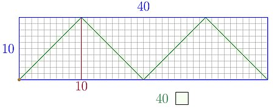

Four mirrors are placed in a way that they form a rectangle with corners at coordinates (0, 0), (max_x, 0), (0, max_y), and (max_x, max_y). A light ray enters this rectangle through a hole at the position (0, 0) and moves at an angle of 45 degrees relative to the axes. Each time it hits one of the mirrors, it gets reflected. In the end, the light ray hits one of the rectangle's corners, and flies out. Your function must determine whether the exit point is either (0, 0) or (max_x, max_y). If it is either (0, 0) or (max_x, max_y), return True and False otherwise.

Example

For max_x = 10 and max_y = 20, the ray goes through the following lattice points: (1, 1), (2, 2), (3, 3), (4, 4), (5, 5), (6, 6), (7, 7), (8, 8), (9, 9), (10, 10), (9, 11), (8, 12), (7, 13), (6, 14), (5, 15), (4, 16), (3, 17), (2, 18), (1, 19), (0, 20).

The ray left the rectangle at position (0, 20), so the result is False.

Here is an image of the light being reflected.d

Also, once completing this kata, please do not rate it based off of the difficulty level(kyu) and instead on whether you think it is a good kata.